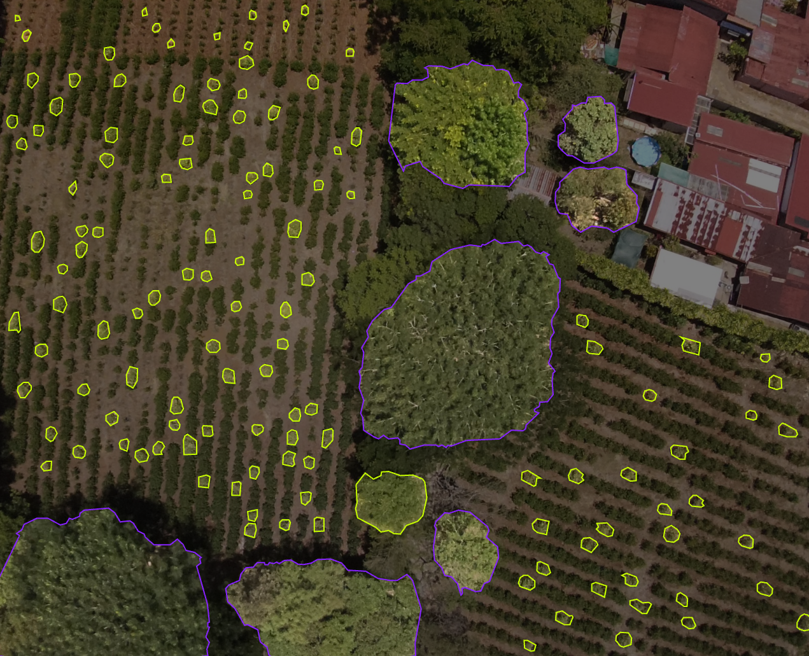
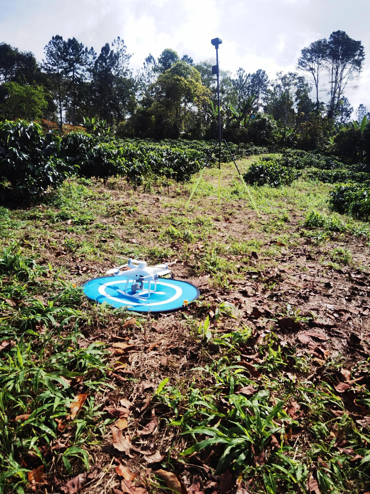

Desarrollo de una herramienta para detectar y contar plantas de café mediante imágenes multiespectrales y YOLOv11
Autora: Marilyn Ortega Rivera

Introducción
El uso de tecnologías geoespaciales en agricultura ha adquirido una importancia creciente debido a la necesidad de contar con información más precisa, actualizada y espacialmente explícita sobre los cultivos. En este contexto, la teledetección, los vehículos aéreos no tripulados (VANT), los sistemas de información geográfica (SIG) y el aprendizaje profundo ofrecen nuevas posibilidades para el monitoreo agrícola y la toma de decisiones basada en datos.

En los últimos años, los modelos de visión por computadora, especialmente los basados en redes neuronales convolucionales, han mostrado un alto potencial para detectar y localizar objetos de manera automática en imágenes. Entre ellos, la familia You Only Look Once (YOLO) se ha consolidado como una de las más utilizadas por su capacidad de equilibrar velocidad y precisión. Su aplicación en agricultura ha permitido detectar cultivos, frutos, plagas, enfermedades y estructuras vegetales en imágenes captadas desde drones o cámaras terrestres.

En el caso del café, estas tecnologías resultan especialmente relevantes. El café constituye un cultivo de gran importancia económica, social y territorial para Costa Rica, pero también enfrenta desafíos asociados con la variabilidad climática, los costos de producción, la reducción del número de productores y las nuevas exigencias de trazabilidad. En este escenario, contar con herramientas que permitan detectar y cuantificar automáticamente plantas de café puede contribuir tanto al monitoreo productivo como al cumplimiento de requerimientos regulatorios.

Este sitio web presenta una propuesta académica basada en mi anteproyecto de investigación, cuyo propósito es desarrollar una herramienta apoyada en YOLOv11 para detectar y contar plantas de café a partir de imágenes multiespectrales captadas con drones en fincas cafetaleras de Costa Rica. La idea no se limita al conteo como un valor numérico, sino que busca generar información geoespacial útil, reproducible y con potencial de integración en plataformas de trazabilidad y sistemas SIG.

Descripción general del tema
El tema central de este proyecto es la detección y conteo automatizado de plantas de café mediante el uso combinado de imágenes multiespectrales, drones y modelos de aprendizaje profundo. La propuesta parte de una necesidad concreta: en muchas fincas el conteo de plantas todavía se realiza de forma manual o mediante estimaciones indirectas, lo que puede generar errores, aumentar costos y dificultar la actualización frecuente de los inventarios.

El anteproyecto plantea que esta situación es especialmente importante en Costa Rica, donde el conteo de plantas tiene implicaciones productivas, económicas y regulatorias. Por una parte, disponer de inventarios confiables ayuda a mejorar la planificación del manejo agrícola, la estimación de densidades y la identificación de vacíos en la plantación. Por otra, la trazabilidad geoespacial se ha vuelto más relevante debido a regulaciones como la EUDR, que exige evidencia espacial sobre la procedencia del café y el uso del suelo.

Desde el punto de vista tecnológico, el proyecto se apoya en el uso de VANT equipados con sensores multiespectrales. Esto permite capturar imágenes con muy alta resolución espacial y registrar información en bandas como el verde, rojo, red-edge y el infrarrojo cercano, lo que mejora la discriminación de la vegetación. Sobre estas imágenes se entrena y valida un modelo YOLOv11 con el fin de detectar plantas individuales de café en distintos escenarios de topografía, sombra y fenología.

Además, la propuesta tiene una dimensión geoespacial muy clara. Los resultados esperados no son solo conteos automáticos, sino también productos espaciales como capas y reportes que puedan integrarse en un SIG y apoyar procesos de monitoreo, análisis territorial y trazabilidad.

Descripción de los datos y sus principales variables
El proyecto se basa en datos geoespaciales obtenidos mediante vuelos con drones sobre fincas cafetaleras de la región central de Costa Rica. Según el anteproyecto, las zonas potenciales de estudio se localizan en cuatro distritos: Piedades Sur, Sabanilla, Barva y Santa María, los cuales forman parte de las regiones cafetaleras Valle Occidental, Valle Central y Los Santos. Estas áreas fueron seleccionadas porque representan distintas condiciones de altitud, pendiente, sombra y manejo del cultivo.

Los principales datos que se utilizarán son los siguientes:

imágenes multiespectrales captadas con VANT
ortomosaicos georreferenciados
límites de finca y de lotes
bloques o unidades de muestreo
datos de validación en campo
resultados de detección generados por el modelo
capas y reportes geoespaciales derivados del análisis
A partir de estos insumos, se trabajará con variables como:

Ubicación de las fincas y lotes, para delimitar espacialmente el análisis.
Cobertura representativa de regiones productoras, rangos altitudinales y condiciones fenológicas.
Imágenes multiespectrales calibradas, que constituyen la base del entrenamiento del modelo.
Número de plantas detectadas, como principal resultado temático.
Coordenadas o localización espacial de cada detección, necesarias para integrar el resultado en un SIG.
Métricas de desempeño del modelo, como mAP, precisión, recall, F1-score y error relativo de conteo.
Condiciones de topografía, sombra y fase del cultivo, que permiten evaluar la robustez del modelo.
Productos geoespaciales finales, como capas y reportes para análisis a nivel de parcela o finca.
Un aspecto importante del anteproyecto es que no solo propone construir un modelo, sino también diseñar el flujo completo: adquisición de imágenes, georreferenciación, calibración radiométrica, construcción del dataset, etiquetado, entrenamiento, validación y generación de productos finales. Esto le da al proyecto un carácter metodológico y aplicado al mismo tiempo.

Problemas que se desean resolver o preguntas de investigación
La propuesta busca responder a un problema claro: ¿cómo diseñar, implementar y validar una herramienta basada en YOLOv11 e imágenes multiespectrales captadas con VANT que permita detectar y contar plantas de café de forma automática, precisa y reproducible en fincas cafetaleras de Costa Rica?

A partir de ese problema central, pueden plantearse preguntas como las siguientes:

¿Es posible detectar y contar plantas de café de manera automática con un modelo basado en YOLOv11?
¿Qué tan preciso puede ser este modelo frente a conteos realizados en campo?
¿Cómo varía su desempeño según la topografía, la sombra y la fase fenológica del cultivo?
¿Puede la información generada convertirse en productos geoespaciales útiles para un SIG?
¿Qué aportes tendría esta herramienta para la gestión productiva y la trazabilidad geoespacial del café?
Estas preguntas son relevantes porque el anteproyecto identifica varias brechas. Entre ellas, destaca la falta de validación de YOLOv11 en escenarios cafetaleros, la integración todavía limitada de imágenes multiespectrales, las dificultades para lograr conteos individuales a escala de finca completa y la ausencia de marcos metodológicos integrales orientados a trazabilidad.

Objetivo general y objetivos específicos
Objetivo general
Desarrollar y validar una herramienta basada en el algoritmo YOLOv11 y en imágenes multiespectrales captadas con vehículos aéreos no tripulados, para la detección y conteo automatizado de plantas de café en fincas cafetaleras de Costa Rica.

Objetivos específicos
Diseñar el flujo de trabajo para la adquisición, georreferenciación y calibración radiométrica de imágenes multiespectrales de cafetales.
Construir y depurar un dataset local para entrenamiento y validación del modelo.
Entrenar y validar el modelo YOLOv11 maximizando métricas de desempeño.
Evaluar la robustez del modelo frente a topografía, sombra y fases de desarrollo del cultivo.
Implementar un prototipo funcional que genere capas y reportes con potencial de integración en SIG y plataformas de trazabilidad.
Importancia académica y aplicada
Este tema tiene relevancia académica porque integra varias áreas de conocimiento: SIG, teledetección, fotogrametría con drones, aprendizaje profundo y agricultura de precisión. También es pertinente porque propone una metodología reproducible y orientada a un problema real del sector cafetalero costarricense.

Desde el punto de vista aplicado, el proyecto puede contribuir a reducir costos de inventario en campo, mejorar la precisión en la cuantificación de plantas y generar información espacial actualizable. Asimismo, puede apoyar procesos de sostenibilidad y trazabilidad en un contexto donde se exige información verificable sobre las plantaciones y su localización.

Imágenes de referencia

Fuente: elaboración propia, con base en el anteproyecto de investigación.

 

Fuente: elaboración propia, con base en el anteproyecto de investigación

Recursos y enlaces de apoyo
GitHub
GitHub Pages
Ultralytics
QGIS
ArcGIS
FAO
Conclusión
La detección y conteo de plantas de café mediante imágenes multiespectrales y modelos de aprendizaje profundo representa una línea de investigación con gran potencial para el monitoreo agrícola. En el contexto de Costa Rica, esta propuesta resulta especialmente pertinente por la importancia del café, la necesidad de mejorar la eficiencia de los inventarios y las crecientes exigencias de trazabilidad geoespacial.

En síntesis, este proyecto busca demostrar que la integración de VANT, imágenes multiespectrales, YOLOv11 y SIG puede generar información útil, precisa y reproducible para apoyar tanto la gestión productiva como los requerimientos de sostenibilidad del sector cafetalero.

Referencias
European Commission. (2023). Reglamento asociado a productos libres de deforestación.
FAO. (2023). Información global sobre producción y comercio de café.
ICAFE. (2024a). Datos de producción y número de productores en Costa Rica.
ICAFE. (2024b). Costos de producción agrícola de café fruta: cosecha 2023–2024.
ICAFE. (2024c). Sinopsis del mercado cafetalero.
ICO. (2019). Información general sobre la caficultura.
Ultralytics. (s. f.). Documentación y recursos sobre YOLO.
